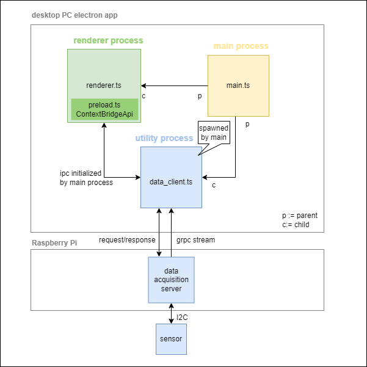

# Electron Flow Viewer

This demonstration aims to provide a high frequency acquisition setup for flow sensors.
The setup is based on [_gRPC_](https://grpc.io/) (Remote Procedure Call) and utilizes several independant components detailed after.
The components can communicate through a standard IP network.

#### Server

The server is a Raspberry Pi connected to the sensor and hosting a _gRPC_ server.
It is responsible for acquiring the data at the highest possible frequency while forwarding it to the connected clients.

#### Visualization client

The visualization client is a [_Electron.js_](https://www.electronjs.org/) application that connects to the server via _gRPC_.
It allows live vizualization of a subsampled stream of data, but also gives access to the data in full resolution once the stream is stopped.

#### Logger client

The logger client can be used to log the data to a file for later analysis.
It also connects to the server through _gRPC_

## IPC in Visualization client

[electronjs - process-model](https://www.electronjs.org/docs/latest/tutorial/process-model)
Electron inherits its multi-process architecture from Chromium. Motivation: each tab should render in its own process.
As an app dev you control two types of electron specific processes:

- <u>main process</u> (parent, `main.ts`)
  - entry point that manages app windows with instances of `BrowserWindow` class (extends node.js EventEmitter)
- <u>render process</u> (child, `render.ts`)
  - main spawns separate render process for each `BrowserWindow` with `index.html` as entrypoint
  - `preload.ts` executes its code in renderer process before web content loading i.e. exposure of `contextBridgeApi` providing an interface to the main process resp NodeJS world.

In addition the <u>utility process</u> `data_client.ts` requests/responses from/to the data acquisition server on a Raspberry Pi. The latter provides a gRPC server providing a stream with sensor data. The Raspberry Pi connects via I2C to sensors attached.
The main process establishes a IPC channel between the renderer process and the utility process.



## How to setup the Raspberry Pi server

See dedicated [documentation](./raspberry-pi-setup/README.md)

## How to run Electron client

The following step should guide you through project setup

### Node.js and npm

One needs Node.js and npm installed. The following versions are suggested (aka stay with node 16):

```
$ node -v
v16.14.2
$ npm -v
8.7.0
```

To install node, possible options are [nvm](https://github.com/nvm-sh/nvm?tab=readme-ov-file#install--update-script) (_Node Version Manager_) or [nvs](https://github.com/jasongin/nvs) (_Node Version Switcher_), amongst others.

### Install dependencies

```
npm install
```

### Run the app

```
npm run compile
npm run start
```

or both at once

```
npm run compstart
```

## Implementation of gRPC client in Electron App

We use the npm lib `@grpc/grpc-js`.

There is a gRPC client example under https://github.com/grpc/grpc-node/tree/@grpc/grpc-js@1.9.0/examples/routeguide which was used as guidance.

Note that we load the protobuf description dynamically using the lib `@grpc/proto-loader`. One could create TypScript files from the protobuf description using protoc, but you need several plugins to make it work.

### Updates in protocol

If there are updates in the protobuf protocol definition, you need to check if you have to adapt the client implementation which you can find in `src/ts/data_client.ts`.

# Local gRPC Server for testing

There is a minimal JavaScript implementation of a gRPC server in the subfolder `dummy-gRPC-server` which can be used for testing. See  `dummy-gRPC-server/README.md`.
You can also run the C-implementation of the server locally.

The server address is defined in  `src/ts/data_client.ts`.
