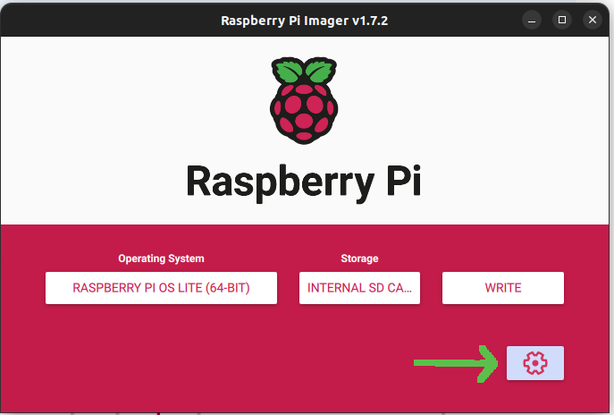

# Setup Raspberry Pi for Flow Reader

## Write SD card

To write the Raspberry Pi OS to an SD card we recommend the usage of the
[Raspberry Pi Imager](https://www.raspberrypi.com/software/). Make sure
you download and install the latest version before proceeding.

1. As Operating System select: Other


2. Select Legacy (bullseye) OS Lite 64 bit (bookworm had problems with Raspi 4)


3. Click on settings to configure SSH and WiFi



4. In the settings, enable SSH, select username/password and configure your WiFi


5. Select the SD card to write the image to and click on write. Once the image is succesfully written
to the SD card, insert it into the Raspberry Pi and start it.

## Configure Raspberry Pi

1. Copy your SSH public key to the raspi for easier access in the future.
```ssh-copy-id pi@raspberrypi.local```
2. Copy flow application (flow_reader) and service (flow-reader.service) onto the raspi using `scp ../server/raspi_build/flow_reader/flow_reader flow-reader.service pi@raspberrypi.local:`

Now login to the raspi using `ssh pi@raspberrypi.local` to start configuring the raspberry pi


1. Enable user space I2C: `sudo raspi-config` under "3 Interface Options" => "I5 I2C"
2. Enable time sync service: `sudo systemctl enable systemd-time-wait-sync  --now`
3. Setup flow reader service: `sudo mv flow-reader.service /etc/systemd/system/ && sudo systemctl daemon-reload && sudo systemctl enable flow-reader.service --now`

Now the flow application is running on the raspberry pi and will automatically
start on reboot after the time service is ready.

You can display the application log using the following command: `journalctl -t yafsdv`

## Install grpc to build the server on the raspberry pi

In order to be able to build the flow-reader server we need to install grpc on the Raspberry Pi.
The installation is done from the source. This includes cloning the grpc repository and building
the grpc and protobuf libraries. On Raspberry Pi this process takes more than an hour.
A detailed description of the required steps can be found in the [gRPC quick-start guide](https://grpc.io/docs/languages/cpp/quickstart/)

## Building the server for raspberry

All the sources that are required to build the server that runs on Raspberry Pi are in the subfolder `server` of the
main repository.
The server is written in C++ and using cmake to build. Prerequisite for successful build of the server is the installation of the grpc code as described in the previous section.
In addition to the c and c++ code the proto file from the subfolder proto is required.

 ### In detail build instructions

-  Copy the sources in server to Raspberry Pi
   ```
   scp ./server pi@raspberrypi.local:server
   ```
- Copy the protofiles in proto to Raspberry Pi
  ```
  scp ./proto pi@raspberrypi.local:proto
  ```
- Open a ssh shell on Raspberry Pi
  ```
  ssh pi@raspberrypi.local
  ```

- Create a cmake/build directory under server and go to this new directory
  ```
  mkdir -p server/cmake/build
  cd server/cmake/build
  ```
- Generate the make files and build the sources. This includes generating the protbuf and grpc code from the protofile.
  The cmake command needs only to be invoked when the contents of the file CMakeLists.txt in the folder ./server 
  changes.
  ```
  cmake ../..
  make
  ```
